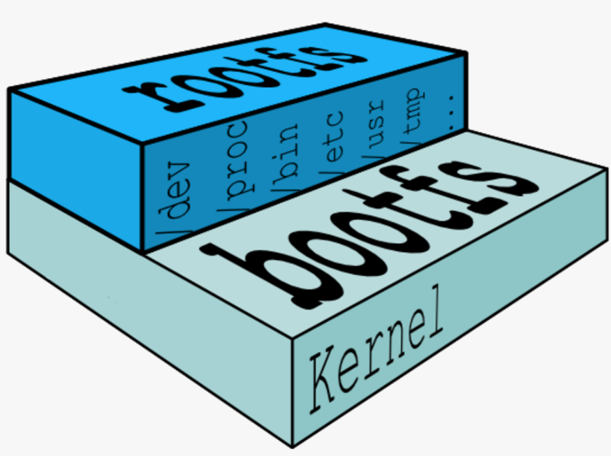
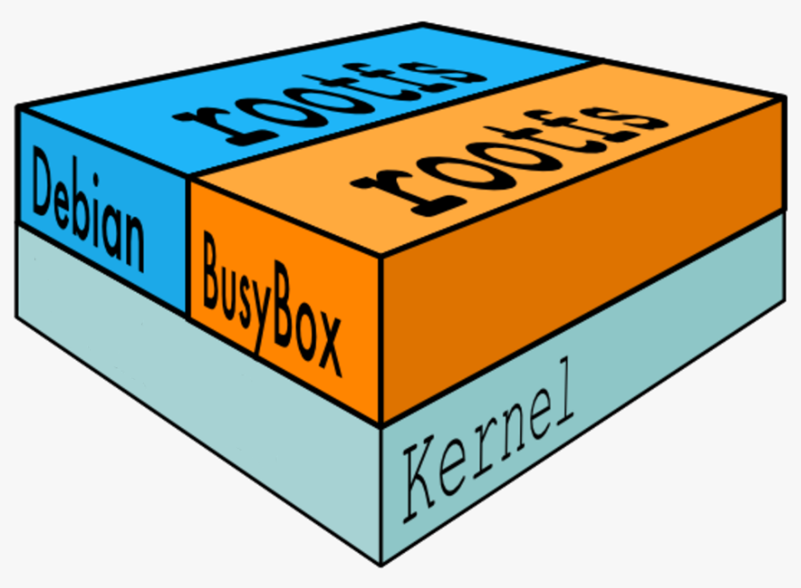
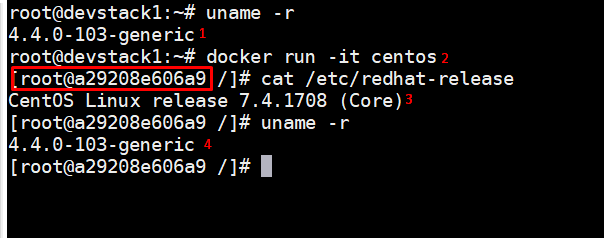

### Image trong Docker
- Image trong docker dùng để tạo ra các container. Một số tài liệu sẽ gọi images mà `mirror`.
- Có 02 loại image phổ biến, đó là các image do chính Docker cung cấp và các image do cộng đồng tự đóng góp.
- Đa số các image sẽ được khởi tạo từ một image base nào đó, các images base thường là các image tối thiểu và đảm bảo đủ môi trường để ứng dụng có thể hoạt động được, do đó chúng rất nhẹ nhàng.
- Trong phần này chúng ta sẽ tìm hiểu về:
  - Tìm hiểu về bên trong của một images cơ bản.
  - Cách tạo ra các images 
  - Cách quản lý và phân phôi các images

  
#### Tìm hiểu về images hello-world

Hãy quay lại với ví dụ về việc tạo ra container `hello-world`

Thực hiện lệnh `docker pull hello-world`, ta sẽ có kết quả.

  ```sh
  Using default tag: latest
  latest: Pulling from library/hello-world
  ca4f61b1923c: Pull complete
  Digest: sha256:083de497cff944f969d8499ab94f07134c50bcf5e6b9559b27182d3fa80ce3f7
  Status: Downloaded newer image for hello-world:latest
  ```
- Trong bước trên, chúng ta đã thực hiện `pull` một images từ internet về, image này có tên là `hello-world`. Ta có thể dùng lệnh `docker search hello-world` để tìm kiếm images từ CLI. Có thể thay hello-world với tên images cần tìm, vì dụ là `ubuntu` hoặc `apache2`

- Image `hello-world` có dung lượng rất nhỏ, chỉ khoảng xấp xỉ 2kB, ta có thể quan sát bằng lệnh `docker images`

  ```sh
  root@devstack1:~# docker images
  REPOSITORY          TAG                 IMAGE ID            CREATED             SIZE
  httpd               latest              01154c38b473        10 days ago         177MB
  hello-world         latest              f2a91732366c        3 months ago        1.85kB
  ```


Tạo ra container từ images `hello-world` vừa tải về ở trên bằng lệnh `docker run hello-world`, kết quả sẽ là:

  ```sh
  root@devstack1:~# docker run hello-world

  Hello from Docker!
  This message shows that your installation appears to be working correctly.

  To generate this message, Docker took the following steps:
   1. The Docker client contacted the Docker daemon.
   2. The Docker daemon pulled the "hello-world" image from the Docker Hub.
      (amd64)
   3. The Docker daemon created a new container from that image which runs the
      executable that produces the output you are currently reading.
   4. The Docker daemon streamed that output to the Docker client, which sent it
      to your terminal.

  To try something more ambitious, you can run an Ubuntu container with:
   $ docker run -it ubuntu bash

  Share images, automate workflows, and more with a free Docker ID:
   https://cloud.docker.com/

  For more examples and ideas, visit:
   https://docs.docker.com/engine/userguide/
  ```

Kết quả trên là nội dung mà container được tạo từ images `hello-world` ở trên, container này chỉ làm nhiệm vụ hiển thị thông báo ra màn hình và dừng hoạt động ngay, để quan sát container này ta dùng lệnh `docker ps -a`

  ```sh
  root@devstack1:~# docker ps -a
  CONTAINER ID        IMAGE               COMMAND              CREATED             STATUS                     PORTS                NAMES
  d5828a777035        hello-world         "/hello"             4 minutes ago       Exited (0) 4 minutes ago                        priceless_swirles
  53458790a068        httpd               "httpd-foreground"   6 hours ago         Up 6 hours                 0.0.0.0:80->80/tcp   upbeat_tereshkova
  ```

Bản chất của việc này là images `hello-world` có chứa một file đặc biệt trong docker, nó được gọi là `Dockerfile`, nội dung của `Dockerfile` là như sau.

  ```sh
  FROM scratch
  COPY hello / 
  CMD ["/hello"]
  ```

Chi tiết về `Dockerfile` sẽ được thảo luận ở các phần sau nhưng trong phần này ta cần nắm được `Dockerfile` chứa các chỉ thị để các container đươc tạo ra từ image `hello-world` này thực hiện, cụ thể là

- `FROM scratch` Images được tạo ra từ `scratch`, có nghĩa là tạo từ đầu (từ con số 0)
- `COPY hello` copy file 'hello' vào thư mục root của container.
- `CMD ["/hello"]` thưc thi file `hello`, file này sẽ in ra thông báo ở màn hình trước mà ta đã nhìn thấy.


Image `hello-world` là một images hoàn chỉnh và chỉ thực hiện để test trong việc tìm hiểu Docker mà thôi. Trong các phần tiếp theo ta sẽ tìm hiểu một loại images dùng để tạo ra các images khác hoặc để tạo ra các container chứa các ứng dụng, images này gọi là images base.


#### Images base
Trong phần trước, chúng ta đã biết được một images nhỏ nhất trong docker là `hello-world` và khái niệm image base. Bản chất thì images base có 02 đặc điểm như sau:
- Images base là một images cơ bản và được tạo ra từ đầu (không được tạo ra từ images nào trước đó).
- Các images khác (images còn lại ngoài images base) sẽ có thể được mở rộng hay nói cách khác là tạo ra từ images base.

Do vậy, các images base trong thực tế thường có tên là các distro, hay thử dụng các lệnh `docker search ubuntu` hoặc `docker search centos` hoặc `docker search debian` để quan sát danh sách các images base có trên docker hub. Ví dụ khi tìm kiếm images có tên là `centos` trên docker hub, ta có kết quả như sau:

```sh
root@devstack1:~# docker search centos
NAME                               DESCRIPTION                                     STARS               OFFICIAL            AUTOMATED
centos                             The official build of CentOS.                   4052                [OK]
ansible/centos7-ansible            Ansible on Centos7                              105                                     [OK]
jdeathe/centos-ssh                 CentOS-6 6.9 x86_64 / CentOS-7 7.4.1708 x86_…   91                                      [OK]
consol/centos-xfce-vnc             Centos container with "headless" VNC session…   45                                      [OK]
imagine10255/centos6-lnmp-php56    centos6-lnmp-php56                              38                                      [OK]
tutum/centos                       Simple CentOS docker image with SSH access      36
gluster/gluster-centos             Official GlusterFS Image [ CentOS-7 +  Glust…   22                                      [OK]
centos/python-35-centos7           Platform for building and running Python 3.5…   18
kinogmt/centos-ssh                 CentOS with SSH                                 17                                      [OK]
openshift/base-centos7             A Centos7 derived base image for Source-To-I…   17
openshift/jenkins-2-centos7        A Centos7 based Jenkins v2.x image for use w…   10
centos/httpd-24-centos7            Platform for running Apache httpd 2.4 or bui…   9
centos/postgresql-96-centos7       PostgreSQL is an advanced Object-Relational …   7
openshift/mysql-55-centos7         DEPRECATED: A Centos7 based MySQL v5.5 image…   6
pivotaldata/centos-gpdb-dev        CentOS image for GPDB development. Tag names…   3
darksheer/centos                   Base Centos Image -- Updated hourly             3                                       [OK]
openshift/wildfly-101-centos7      A Centos7 based WildFly v10.1 image for use …   3
openshift/jenkins-1-centos7        DEPRECATED: A Centos7 based Jenkins v1.x ima…   3
openshift/php-55-centos7           DEPRECATED: A Centos7 based PHP v5.5 image f…   1
blacklabelops/centos               CentOS Base Image! Built and Updates Daily!     1                                       [OK]
pivotaldata/centos                 Base centos, freshened up a little with a Do…   1
pivotaldata/centos-mingw           Using the mingw toolchain to cross-compile t…   1
pivotaldata/centos-gcc-toolchain   CentOS with a toolchain, but unaffiliated wi…   0
jameseckersall/sonarr-centos       Sonarr on CentOS 7                              0                                       [OK]
smartentry/centos                  centos with smartentry                          0                                       [OK]
```

Trong ví dụ này ta sẽ thấy có danh sách các images của centos, dòng đầu tiên sẽ là images chính thức do Docker cung cấp và được đánh dấu là `OFFICIAL`. Chúng ta sẽ tải images cenots này về để tìm hiểu tiếp, sử dụng lệnh `docker pull centos` và ta có kết quả.

```sh
root@devstack1:~# docker pull centos
Using default tag: latest
latest: Pulling from library/centos
af4b0a2388c6: Pull complete
Digest: sha256:2671f7a3eea36ce43609e9fe7435ade83094291055f1c96d9d1d1d7c0b986a5d
Status: Downloaded newer image for centos:latest
```

- Sử dụng lệnh `docker images` để xem danh sách các images đã tải về

```sh
root@devstack1:~# docker images
REPOSITORY          TAG                 IMAGE ID            CREATED             SIZE
httpd               latest              01154c38b473        10 days ago         177MB
centos              latest              ff426288ea90        6 weeks ago         207MB
hello-world         latest              f2a91732366c        3 months ago        1.85kB
```

Trong kết quả trên, ta thấy image `centos` có dung lượng là 177MB. Tại sao lại có dung lượng nhỏ hơn so với việc chúng ta có một máy ảo với hệ điều hành là CentOS vậy nhỉ? Và đó chính là ưu điểm và đặc tính của Docker đấy. 

Trước khi đi tìm hiểu lý do tại sao image centos nói riêng hay các images khác của docker lại có dung lượng nhỏ như vậy, ta sẽ tìm hiểu về thành phần kernel của Linux một chút.

Hệ điều hành linux bao gồm `kernel space` và `user space`



Trong đó:
- Kernel space chính là kernel (lõi của hệ điều hành), chúng chứa các file khởi động của hệ thống.
- user space chính là các file hệ thống rootfs, các file này bao gồm các trong các thư mục như /dev, /proc, /bin ...


Trong các image base của container thì phần kernel sẽ được sử dụng của máy chủ cài đặt container engine (trong tài liệu này là cài đặt docker deamon), do vậy chỉ cần có thêm thành phần `rootfs` là images đã có thể hoạt động. Mà thông thường thì phần `rootfs` có dung lượng rất nhỏ và chỉ cần chứa các câu lệnh hoặc công cụ cơ bản là đã có thể hoạt động được. 

Như vậy thì images base trong container sẽ cung cấp thành phần cơ bản nhất và đủ để các contanier có thể hoạt động được. Container hoạt động như một distro linux.


Có thể mô tả việc tạo ra images centos từ `Dockerfile` có các chỉ thị như sau:

  ```sh
  FROM scratch
  ADD cenots-7-docker.tar.xz /
  CMD ["/bin/bash"]
  ```

Trong đó:
- `FROM scratch` là chỉ thị nói rằng images này được tạo từ đầu.
- Chỉ thị `ADD` thực hiện việc giải nén các file hệ thống của CentOS-7 vào thư mục root, các file này sẽ chứa các file của `rootfs`. Lưu ý: Có thể quan sát dockerfile này trên dockerhub, sau này ta sẽ tìm hiểu thêm nhé.
 

Docker hỗ trợ chạy nhiều hệ điều hành Linux trong một máy chủ chính vì có thể có nhiều `rootfs` trong một hệ thống, hãy xem hình dưới.



Ta có thể thấy 02 layer có sử dụng chung một kernel, đây chính là bootfs được dùng chung bởi 02 `rootfs`. Điều này mang lại lợi thế và sự linh hoạt cho docker nên rất được ưa chuộng. Trong tài liệu này tôi đã sử dụng hệ điều hành Ubuntu server 16.04 để cài đặt Docker, sau đó đã tải images là centos về, bây giờ hãy qua sát kernel của máy cài docker và kernel của container được tạo ra từ images centos.




Trong hình trên ta hãy quan sát kỹ như sau
- `1`: Là kết quả của lệnh kiểm tra kernel của máy host (máy cài docker), phiên bản là `4.4.0-103-generic`
- `2`: Thực hiện lệnh `docker run -it centos`, với lệnh này ta sẽ tạo contanier từ image có tên là centos và sử dụng tùy chọn `-it` để thao tác trực tiếp với container luôn (hãy quan sát khung đỏ - hiện đang ở trong nội tại của container).
- `3`: Thực hiện kiểm tra phiên bản của hệ điều hành bên trong container, theo đúng lý thuyết thì đó là hệ điều hành CentOS-7.
- `4`: Kiểm tra kernel của container, lúc này vẫn ở trong container, ta thấy phiên bản trùng với kernel của host ở (1)


Để thoát ra khỏi container ta thực hiện tổ hợp phím `CTL + C`

Kết luận: 
- Dung lượng của các images rất nhẹ vì chúng chỉ cần có thêm các lớp tối thiểu để đảm bảo hoạt động của distro, lớp kernel sẽ sử dụng của host.


